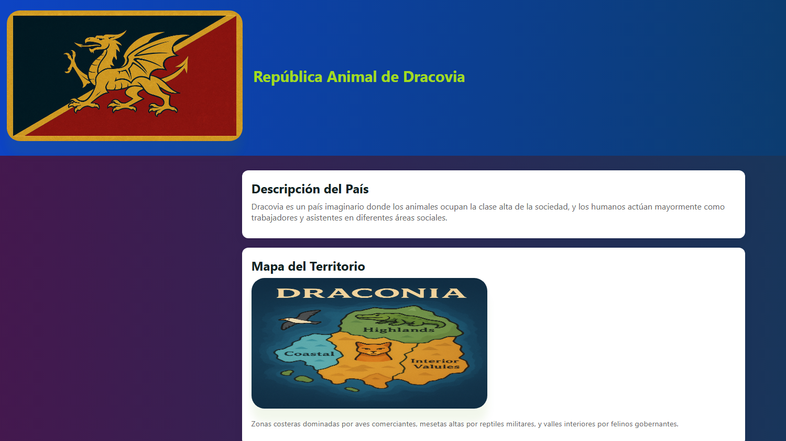

# intro-html
# 🐉 República Animal de Dracovia  
**Proyecto HTML + CSS + Imágenes — Mundo Fantástico para Documentación y Desarrollo Web**

La **República Animal de Dracovia** es un proyecto creativo y educativo desarrollado con **HTML5, CSS3 y archivos multimedia**, ideal como práctica para estructuración web, estilo modular y contenido narrativo.  
El objetivo del proyecto es crear una página completa sobre un país ficticio donde **los animales conforman la clase dominante** y los humanos actúan como trabajadores y asistentes dentro de una sociedad fantástica.

## 🚀 Características del Proyecto

- 🌐 **Estructura web profesional**:  
  - `index.html` como punto de entrada  
  - estilos en `/css/styles.css`  
  - imágenes en `/images/`  
  - carpetas opcionales para scripts o clases  

- 🐉 **Mundo ficticio original**:  
  Dracovia está dividida en zonas controladas por aves, reptiles y felinos, con humanos integrados en roles laborales.

- 🖼️ **Imágenes originales generadas** para:  
  - Bandera de Dracovia  
  - Mapa del territorio  
  - Elementos visuales

    

- 📊 **Tablas informativas**:  
  Población, clases sociales, castigos según especie, tipos de trabajo, etc.

- 🎨 **Diseño moderno**:  
  Uso de variables CSS, tarjetas, sombreado, layout responsivo y estilo limpio.

---

## 🗂️ Estructura del Proyecto

